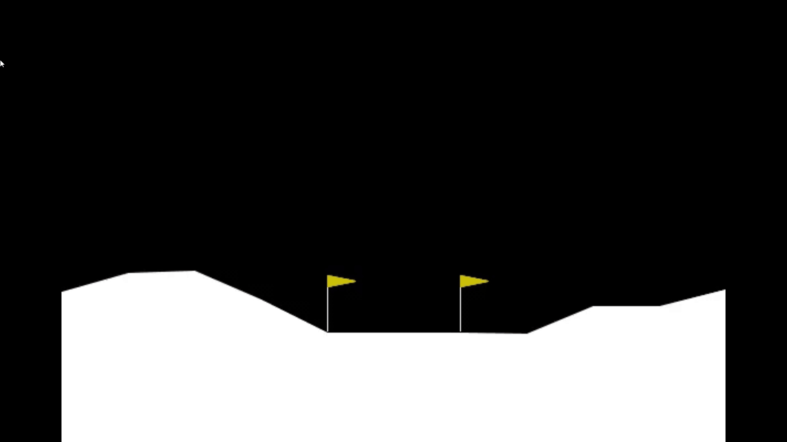
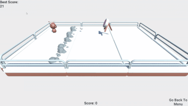
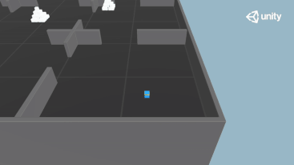
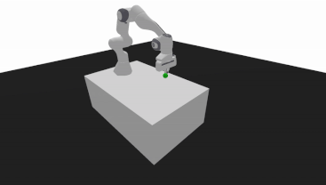
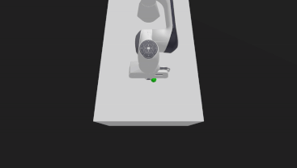
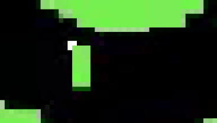
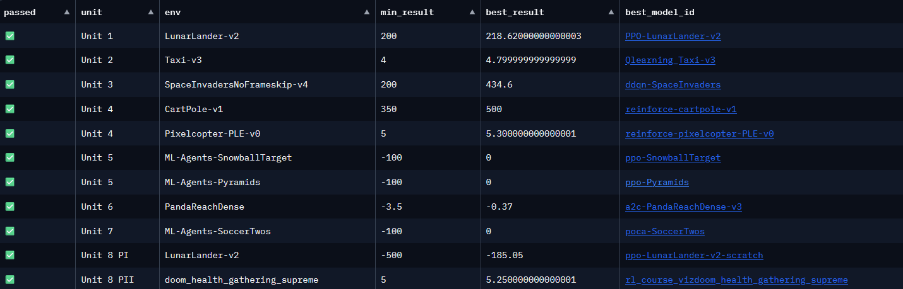

## HuggingFace Reinforcement Learning Course:

<table>
  <tr>
    <td align="center">
       
      <strong>Taxi-v3</strong> using Tabular Q-learning
    </td>
    <td align="center">
       
      <strong>LunarLander-v2</strong> using Proximal Policy Optimization
    </td>
  </tr>

  <tr>
    <td align="center">
       
      PPO on <strong>Unity's ML-Agents: Snowball Target env</strong>
    </td>
    <td align="center">
       
      PPO on <strong>Unity's ML-Agents: Pyramids env</strong>
    </td>
  </tr>

  <tr>
    <td align="center">
       
      A2C on<strong> PandaReachDense-v3</strong> env
    </td>
    <td align="center">
       
      A2C on <strong>PandaReachDense-v3 </strong>env (top-view)
    </td>
  </tr>

  <tr>
    <td align="center">
       
      PPO on<strong> Vizdoom's health gathering supreme</strong> env
    </td>
    <td align="center">
       
      REINFORCE on<strong> Pixelcopter-PLE-v0</strong> env
    </td>
  </tr>
</table>

<h3 align="center">Agent Scores</h3>

  

